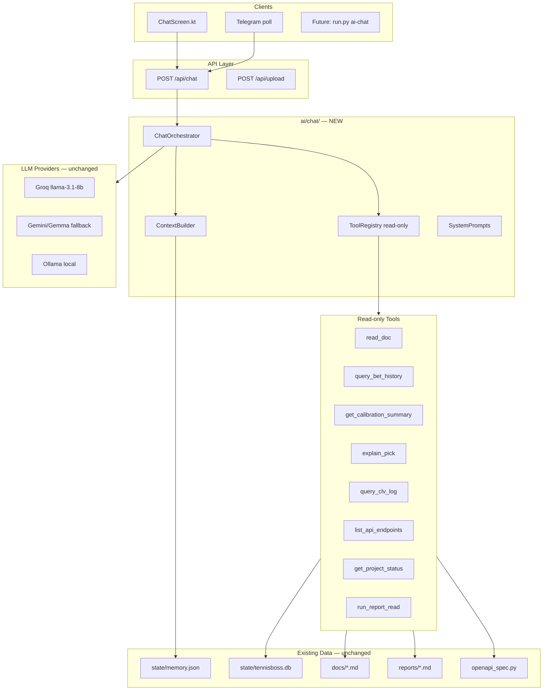
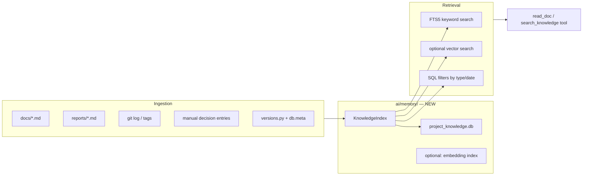
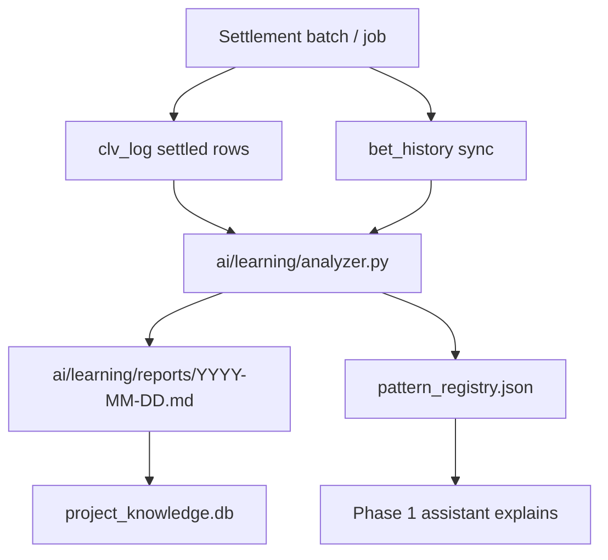

# TennisBoss — AI Assistant Architecture Plan

**Date:** 16 juillet 2026  
**Author:** Lead AI Architect (audit session)  
**Status:** Plan only — no production code in this deliverable  
**Repo:** `C:\Users\donpa\TennisBoss`

---

## Executive summary

TennisBoss already ships a **working conversational assistant** (`bot/chat.py` → `POST /api/chat` → Android `ChatScreen.kt`) grounded in live model state (`state/memory.json`), SQLite, and optional web search. What it lacks is a **structured analytical layer**: read-only tool access to docs, bet_history, calibration reports, logging health, and project decisions — plus a **separate project memory** distinct from training memory (`bot/memory.py`).

This plan proposes five phases:

| Phase | Goal | ROI | Effort |
|-------|------|-----|--------|
| **1** | Read-only tool-calling chat assistant | **Highest** | 3–5 days |
| **2** | Searchable project memory / knowledge base | High | 4–6 days |
| **3** | Post-settlement error analysis (suggestions only) | Medium | 5–8 days |
| **4** | Gradual folder reorganization (`ai/`, `prediction/`, …) | Medium (long-term) | 2–3 weeks (incremental) |
| **5** | Documentation-first design system for assistant UX | Low–medium | 2–3 days |

**Smallest valuable step after this plan:** Phase 1 Slice 1 — add a read-only `ai/chat/tools/` registry with 5 tools (`read_doc`, `query_bet_history`, `get_calibration_summary`, `explain_pick`, `list_openapi_endpoints`) and wire them into `bot/chat.py` behind a feature flag, without touching frozen predictor logic.

**Critical constraint:** The assistant is **analytical only**. It never places bets, never modifies predictions, and never auto-writes production model parameters.

---

## 1. Current state audit

### 1.1 Repository structure

```
TennisBoss/
├── bot/                    # ~78 Python modules (flat) — core backend
│   ├── api.py              # Flask API (~45 routes, ~4000 lines)
│   ├── chat.py             # LLM chat + context grounding
│   ├── memory.py           # Training memory (weights, players, elo)
│   ├── db.py               # SQLite schema + queries
│   ├── predictor.py        # 🔒 FROZEN
│   ├── calibrate.py        # 🔒 FROZEN
│   ├── openapi_spec.py     # Hand-written OpenAPI 3.0
│   ├── agent_router.py     # AGENT_PROMPTS + OpenClaw stubs
│   ├── auto_learner.py     # Surface ELO blend tuning (production-adjacent)
│   ├── mistake_learner.py  # Danger-zone segmentation from settled picks
│   ├── calibration_report.py, validate_tis.py, compare_engines.py
│   └── … feeders, intelligence, CLV, settlement, scheduler
├── android/                # Kotlin/Compose app (13 screens, MVVM)
├── docs/                   # 11 audit/report markdown files
├── tests/                  # 46 Python test files (~357 tests)
├── scripts/                # 17 ops/audit scripts
├── reports/                # Generated MD (calibration_report.md, tis_validation.md, …)
├── state/                  # memory.json + tennisboss.db (runtime)
├── logs/                   # tennisboss.log
├── run.py                  # CLI entry (train, serve, validate-tis, …)
├── AGENTS.md               # Conceptual multi-agent roles (not wired to code)
├── PROJECT_STATUS.md       # ~90% complete, release-ready (2026-07-14)
└── MASTER_TODO.md          # Prioritized task backlog
```

**Notable gaps vs target structure:** No `ai/`, `prediction/`, `data/`, `api/`, `logging/`, `monitoring/`, or `dashboard/` top-level packages yet. Backend logic lives in flat `bot/`. Android is the only dashboard.

### 1.2 Key modules map

| Domain | Primary files | Role |
|--------|---------------|------|
| **API** | `bot/api.py`, `bot/openapi_spec.py` | Flask REST for Android + Telegram |
| **Prediction** | `bot/predictor.py`, `bot/features.py`, `bot/elo.py` | 1st-set → match prob, ELO blend |
| **Calibration** | `bot/calibrate.py`, `bot/versions.py` | Platt / temperature k, version labels |
| **Value / picks** | `bot/api.py` (`/api/value`), `bot/clv.py` | EV detection, CLV logging |
| **Intelligence** | `bot/match_intelligence.py`, `bot/intelligence_layer.py` | TIS score, signals |
| **Data** | `bot/db.py`, `bot/datasource.py`, `*feeder.py` | SQLite + ingestion |
| **Training memory** | `bot/memory.py`, `state/memory.json` | Learned weights, player profiles, ELO |
| **Chat / LLM** | `bot/chat.py`, `bot/agent_router.py`, `bot/search.py` | Groq/Gemini/Ollama + grounding |
| **Learning (prod)** | `bot/learner.py`, `bot/auto_learner.py`, `bot/mistake_learner.py` | Weight training, danger zones |
| **Ops** | `bot/scheduler.py`, `bot/monitor.py`, `bot/supervisor.py` | 11 scheduled jobs, health checks |
| **Android** | `android/.../ChatScreen.kt`, `ChatViewModel.kt` | UI consumer of `/api/chat` |
| **Logging / repro** | `bot/db.py` (`clv_log`), `docs/LOGGING_SCHEMA.md` | 17 additive repro columns per pick |

### 1.3 API endpoints (assistant-relevant)

Full spec: `bot/openapi_spec.py` (served at `/api/openapi.json`, Swagger at `/api/docs`).

| Tag | Endpoints | Assistant use |
|-----|-----------|---------------|
| **core** | `/health`, `/api/status`, `/api/players`, `/api/player`, `/api/h2h`, `/api/predict` | Architecture Q&A, player/match explanation |
| **matches** | `/api/upcoming`, `/api/live`, `/api/inplay/*` | Match context, live state |
| **value** | `/api/value`, `/api/value/open`, `/api/value/history` | Explain picks (read-only) |
| **intelligence** | `/api/insight`, `/api/match/intelligence`, `/api/intelligence/*` | TIS / signal explanation |
| **observability** | `/api/logging/health`, `/api/monitor/status`, `/api/scanner/status` | Ops / data-quality Q&A |
| **performance** | `/api/bet-history/stats`, `/api/bet-history/recent`, `/api/bet-history/calibration`, `/api/clv`, `/api/clv/weekly`, `/api/calibration` | ROI, calibration analysis |
| **chat** | `/api/chat`, `/api/upload` | Primary assistant interface |
| **admin** | `/api/settlement/run`, `/api/learn/run`, `/api/ingest/*` | **Blocked for assistant** (write/admin) |

Auth: `X-API-Token` when `TENNISBOSS_API_TOKEN` is set (`bot/api.py` `before_request`). `/health` and `/privacy` are public.

### 1.4 Database tables

Defined in `bot/db.py::init()`:

| Table | Rows (prod snapshot) | Assistant relevance |
|-------|----------------------|---------------------|
| `players` | ~4,524 | Player lookup, ELO context |
| `matches` | ~94k archive | H2H, surface, historical context |
| `bet_history` | **97 settled** (sparse; need 200+) | Performance / calibration Q&A |
| `clv_log` | ~4.8k settled | Full repro fields per `LOGGING_SCHEMA.md` |
| `value_picks` | open + settled | Scanner picks explanation |
| `calibration_history` | time series | Calibration drift |
| `market_snapshots` | line movement | Odds context |
| `player_rankings` | ATP/WTA ranks | Ranking-diff explanation |
| `predictions` | ad-hoc CLI predictions | Low priority |
| `inplay_picks` | manual live picks | In-play analysis |
| `followed_players`, `followed_matches` | user prefs | Personalization context |
| `meta` | key-value ops state | Versions, last monitor check |

`bet_history` schema (settled picks):

```
event_key, player1, player2, date, prediction, pick_side, odds,
confidence, result, profit_loss, clv_pct, surface, model_version, bookmaker, ts
```

`clv_log` extended repro fields (per `docs/LOGGING_SCHEMA.md`): `tournament`, `tournament_level`, `surface`, `player_rank`, `opponent_rank`, `ranking_diff`, `model_prob_raw`, `model_prob_calibrated`, `market_prob`, `market_disagreement`, `ev_pct`, `calib_k`, `market_blend_w`, `calibration_version`, `predictor_version`, `feature_set_version`, `opening_odds`, …

### 1.5 Existing docs (knowledge sources)

| Document | Content |
|----------|---------|
| `AGENTS.md` | Conceptual multi-agent roles (stats, odds, analyzer, coder) |
| `PROJECT_STATUS.md` | Completion ~90%, release-ready, known risks |
| `MASTER_TODO.md` | Prioritized backlog with file references |
| `docs/PRODUCTION_RELIABILITY_REPORT.md` | Prod health, bet_history sparsity (n=97), scheduler jobs |
| `docs/LOGGING_SCHEMA.md` | clv_log reproducibility schema |
| `docs/surface_features.md` | Surface benchmark rejection decision |
| `docs/LEAD_ENGINEER_AUDIT.md` | Phase 12 audit, compare_engines guidance |
| `docs/EVIDENCE_DRIVEN_OPTIMIZATION.md` | Logging gap analysis (origin of LOGGING_SCHEMA) |
| `docs/MARKET_EFFICIENCY_AUDIT.md` | Market efficiency analysis |
| `docs/STABILIZATION_REPORT.md` | bet_history backfill, rankings retry |
| `docs/CLUTCH_BLEND_WALKFORWARD_VALIDATION.md` | Walk-forward validation |
| `docs/CTO_SESSION_REPORT.md` | Ops session notes |
| `docs/DATA_PIPELINE_AUDIT.md` | Pipeline audit |
| `AI_CHAT_AUDIT.md` | **Stale** — references removed `app/` FastAPI layer |
| `QUICK_START_CHAT.md`, `RELEASE_NOTES_CHAT.md` | Chat setup / history |

Generated reports in `reports/`: `calibration_report.md`, `tis_validation.md`, `surface_benchmark.md`.

### 1.6 Tests

| Suite | Count | Location |
|-------|-------|----------|
| Backend pytest | **~357** (per `PROJECT_STATUS.md`) | `tests/test_*.py` (46 files) |
| Android unit | **54** | `android/app/src/test/` |
| Chat-specific | **25** | `tests/test_chat.py` |
| bet_history | **12** | `tests/test_bet_history.py` |
| logging schema | **14** | `tests/test_logging_schema.py` |
| validate_tis | **6** | `tests/test_validate_tis.py` |

CI: GitHub Actions runs backend pytest + Android unit tests.

### 1.7 CLI commands (assistant should know about)

From `run.py`:

| Command | Module | Purpose |
|---------|--------|---------|
| `python run.py serve` | `bot/api.py` | Start Flask API |
| `python run.py train` | `bot/learner.py` | Training cycle → `memory.json` |
| `python run.py validate-tis` | `bot/validate_tis.py` | TIS math validation → `reports/tis_validation.md` |
| `python run.py calibration-report` | `bot/calibration_report.py` | Calibration MD → `reports/calibration_report.md` |
| `python run.py backfill-bet-history` | `bot/db.py` | Fill `bet_history` from `clv_log` |
| `python run.py clv-weekly` | `bot/clv.py` | Weekly CLV report |
| `python run.py surface-benchmark` | `bot/surface_experiment.py` | Offline surface experiment |
| `python run.py surface-data-audit` | `scripts/surface_data_audit.py` | Surface coverage report |
| `python run.py compare-engines` | — | **Documented in MASTER_TODO / LEAD_ENGINEER_AUDIT but NOT registered in `run.py`**; offline code exists in `bot/compare_engines.py` |

### 1.8 Logging & reproducibility

- **Application log:** `bot/log.py` → `logs/tennisboss.log` (console + file, thread-safe).
- **Pick reproducibility:** `docs/LOGGING_SCHEMA.md` — 17 additive `clv_log` columns, `bot/versions.py` version constants (`PREDICTOR_VERSION`, `FEATURE_SET_VERSION`, `CALIBRATION_VERSION`).
- **Health endpoint:** `GET /api/logging/health` — `db.clv_logging_completeness_report()`.
- **Monitor:** `bot/monitor.py` + `GET /api/monitor/status`; scheduler `job_monitor` every 5 min.

### 1.9 Current AI / LLM capability assessment

#### What exists today

| Capability | Implementation | Maturity |
|------------|----------------|----------|
| **Chat endpoint** | `POST /api/chat` in `bot/api.py` | Production |
| **LLM providers** | Groq (`llama-3.1-8b-instant`) → Gemini/Gemma → Ollama local | Production with fallback chain |
| **Context grounding** | `build_match_context()` — player detection, calibrated predict, H2H, open value picks | Good for named players |
| **Agent prefixes** | `@stats_agent`, `@odds_agent`, `@analyzer_agent`, `@coder_agent` via `strip_agent_prefix()` | Prompt injection only |
| **Anti-hallucination** | `no_fabrication_instr`, `honesty_instr`, `context_used` flag in response | Tested (`test_chat.py`) |
| **Web search** | `bot/search.py` — API-Tennis + DDG for fresh results | Optional, 10s timeout |
| **File upload Q&A** | `POST /api/upload` + `bot/file_parser.py` | PDF/CSV/TXT |
| **Android UI** | `ChatScreen.kt`, `ChatViewModel.kt` — history window, upload | Production |
| **Telegram** | `api.py` `_tg_poll_loop` forwards to `/api/chat` | Admin-only |
| **Conceptual agents** | `AGENTS.md` + `AGENT_PROMPTS` | Docs > runtime |

#### Gaps

| Gap | Impact | Phase |
|-----|--------|-------|
| No tool-calling / function registry | Cannot reliably query DB, docs, reports | Phase 1 |
| `memory.json` conflated with "project memory" | Training state ≠ architecture decisions | Phase 2 |
| No embeddings / semantic search | Keyword-only doc retrieval | Phase 2 |
| No structured bet_history / calibration analysis in chat | User must use Performance screen manually | Phase 1 |
| `compare-engines` CLI not wired | Documented workflow broken | Phase 1 (tool wrapper) |
| `AI_CHAT_AUDIT.md` stale (removed `app/`) | Misleading architecture docs | Phase 2 ingest |
| `agent_router.spawn_agent_session()` stubbed | No real sub-agent isolation | Phase 1 (optional) |
| `auto_learner` / `mistake_learner` not exposed to chat | Learning exists but opaque to user | Phase 3 |
| No conversation persistence (Android) | History lost on screen exit | Phase 5 |
| MAX_TOKENS=120, TEMPERATURE=0.7 | Too short for analytical answers | Phase 1 config split |

#### What is explicitly NOT present

- No OpenAI Assistants API, no Anthropic SDK, no LangChain, no vector DB, no RAG pipeline, no fine-tuning loop.

---

## 2. Frozen boundaries

The following are **off-limits** for the AI assistant and for any automated self-learning loop. The assistant may **read and explain** them; it must never **modify** them without explicit human approval.

| Boundary | Files / endpoints | Rule |
|----------|-------------------|------|
| **Predictor math** | `bot/predictor.py`, `bot/features.py`, `bot/elo.py` | Read-only explanation |
| **Calibration logic** | `bot/calibrate.py`, Platt/temperature application | Read-only explanation |
| **Market blend** | `_MKT_W`, `market_blend_w` in `bot/api.py` | Read-only explanation |
| **Value decision** | `/api/value` thresholds (`min_ev`, `max_odds`, `min_confidence`), `is_value` filters | Read-only explanation |
| **Pick selection** | `_value_scanner_loop()`, `clv.seed_pick()` decision gates | Read-only explanation |
| **Betting thresholds** | `bot/mistake_learner.py` ROI thresholds (inform only) | Suggest, never auto-apply |
| **Training memory writes** | `memory.save()`, `run.py train`, `/api/learn/run` | Blocked for assistant |
| **Settlement / ingestion** | `/api/settlement/run`, `/api/ingest/*`, feeders | Blocked for assistant |
| **Version bumps** | `bot/versions.py` | Human-only |

Enforcement: all assistant tools marked `read_only=True`; write endpoints excluded from tool registry; code review gate on any `ai/` module importing `predictor`, `calibrate`, or `learner.train`.

---

## 3. Phase 1 — AI Chat Assistant (read-only analytical layer)

### 3.1 Goals

Support natural-language queries about:

- Project architecture, docs, API surface
- Predictions and picks (explain, not change)
- Calibration methodology and current metrics
- `bet_history` performance, ROI, surface/bookmaker breakdowns
- Technical Q&A (scheduler jobs, logging schema, data pipeline)
- Experiment reports (`surface_features.md`, `calibration_report.md`)

### 3.2 Architecture



### 3.3 Orchestration model

**Recommended:** lightweight **tool-calling loop** (no LangChain):

1. Classify intent (regex + optional small LLM call): `architecture | prediction | performance | calibration | ops | general`.
2. If intent matches a tool, execute tool(s), inject structured JSON result into system context.
3. Call existing `bot/chat.py::chat()` with `extra_context` = tool output + doc excerpts.
4. Return `{ reply, context_used, tools_called[], agent }`.

Preserve existing `build_match_context()` for player-named queries. Tools supplement, not replace, current grounding.

### 3.4 Read-only tool interfaces

```python
# ai/chat/tools/registry.py — interface sketch (not production code)

@dataclass
class ToolResult:
    name: str
    data: dict
    summary: str          # human-readable, token-budgeted
    source: str           # file/table/endpoint provenance

class ReadOnlyTool(Protocol):
    name: str
    description: str
    def run(self, params: dict) -> ToolResult: ...
```

| Tool | Params | Backend | Example question |
|------|--------|---------|------------------|
| `read_doc` | `path`, `section?` | `docs/*.md`, `AGENTS.md`, `PROJECT_STATUS.md` | "What did we decide on surface features?" |
| `query_bet_history` | `days`, `surface?`, `limit` | `db.bet_history_stats()`, `list_bet_history()` | "ROI last 30 days on clay?" |
| `get_calibration_summary` | `days` | `db.bet_history_calibration()`, `calibration_report.generate()` | "Are 70% predictions well calibrated?" |
| `explain_pick` | `event_key` or `p1,p2,date` | `clv_log` + `value_picks` + repro fields | "Why did we pick X in match Y?" |
| `query_clv_log` | `since`, `incomplete_only?` | `db.find_incomplete_clv_picks()` | "Which picks lack tournament metadata?" |
| `list_api_endpoints` | `tag?` | `openapi_spec.build_spec()` | "What bet-history endpoints exist?" |
| `get_project_status` | — | Parse `PROJECT_STATUS.md` + `/api/status` | "Is the app release-ready?" |
| `get_logging_health` | `bucket` | `db.clv_logging_completeness_report()` | "Logging completeness this week?" |
| `get_open_value_picks` | `limit` | `db.list_value_picks_open()` | "Best open value bets right now?" |
| `run_report_read` | `report` | Read `reports/calibration_report.md` etc. | "Summarize last calibration report" |

**Blocked tools (never implement):** `train_model`, `settle_match`, `place_bet`, `modify_memory`, `bump_version`, `run_learn`.

### 3.5 API changes (additive only)

Extend `POST /api/chat` response:

```json
{
  "reply": "...",
  "context_used": true,
  "agent": "stats_agent",
  "tools_called": ["query_bet_history", "get_calibration_summary"],
  "sources": ["docs/surface_features.md", "bet_history"]
}
```

New optional request fields:

```json
{
  "message": "...",
  "history": [],
  "mode": "analyst",
  "max_tokens": 512
}
```

`mode=analyst` raises `MAX_TOKENS` and lowers `TEMPERATURE` for factual Q&A. Default `mode=chat` keeps current mobile-friendly brevity.

Feature flag: `TENNISBOSS_AI_TOOLS=1` in `bot/config.py`.

### 3.6 Prompt strategy

Layer prompts (do not replace `AGENT_PROMPTS`):

1. **Base:** existing TennisBoss system prompt + honesty / no-fabrication rules.
2. **Analyst addendum:** "You are a read-only analyst. Cite sources. Never recommend bet sizing. Flag sparse data (n<200)."
3. **Agent addendum:** existing `@stats_agent` etc. prompts from `bot/agent_router.py`.
4. **Tool output block:** structured JSON + short summary.

### 3.7 Android impact (Phase 5 preview)

`ChatViewModel.kt` already displays `context_used`. Extend to show `tools_called` / `sources` as collapsible "Sources" chip — documentation-first, no visual redesign required in Phase 1.

---

## 4. Phase 2 — Project Memory / Knowledge System

### 4.1 Problem

`bot/memory.py` / `state/memory.json` stores **model training state** (weights, player EMA, ELO). It must not store architecture decisions, experiment outcomes, or deployment history. Conflating the two caused confusion in audits (`docs/CLUTCH_BLEND_WALKFORWARD_VALIDATION.md` references `memory.json` as frozen weights — correct for model, wrong for project knowledge).

### 4.2 Architecture



### 4.3 Memory schema (`project_knowledge.db`)

```sql
CREATE TABLE knowledge_entries (
    id            INTEGER PRIMARY KEY,
    entry_type    TEXT NOT NULL,  -- 'architecture','decision','experiment',
                                  -- 'deployment','api_doc','calibration','audit'
    title         TEXT NOT NULL,
    body          TEXT NOT NULL,  -- markdown chunk
    source_path   TEXT,           -- e.g. docs/surface_features.md
    source_hash   TEXT,           -- sha256 of source file at ingest
    tags          TEXT,           -- JSON array
    created_at    TEXT NOT NULL,
    valid_until   TEXT,           -- null = still valid
    superseded_by INTEGER,        -- FK → knowledge_entries.id
    metadata      TEXT            -- JSON: versions, commit, author
);

CREATE VIRTUAL TABLE knowledge_fts USING fts5(
    title, body, tags, content='knowledge_entries', content_rowid='id'
);

CREATE TABLE deployment_history (
    id          INTEGER PRIMARY KEY,
    deployed_at TEXT NOT NULL,
    git_hash    TEXT,
    component   TEXT,   -- 'bot','android','scheduler'
    notes       TEXT,
    restart_cmd TEXT
);

CREATE TABLE model_snapshots (
    id                    INTEGER PRIMARY KEY,
    captured_at           TEXT NOT NULL,
    predictor_version     TEXT,
    feature_set_version   TEXT,
    calibration_version   TEXT,
    calib_k               REAL,
    market_blend_w        REAL,
    platt_a               REAL,
    platt_b               REAL,
    memory_json_hash      TEXT  -- fingerprint only, not full copy
);
```

### 4.4 What to store

| Category | Examples | Source |
|----------|----------|--------|
| Architecture | AGENTS.md roles, data flow diagrams | `docs/LEAD_ENGINEER_AUDIT.md` |
| API docs | Endpoint list, auth rules | `bot/openapi_spec.py` |
| Model versions | PREDICTOR_VERSION bumps | `bot/versions.py` |
| Experiment reports | Surface benchmark rejection | `docs/surface_features.md`, `reports/surface_benchmark.md` |
| Audit reports | Prod reliability, logging schema | `docs/PRODUCTION_RELIABILITY_REPORT.md` |
| Decisions + reasons | "Do NOT wire surface features" | Manual + parsed from docs |
| Deployment history | Service restarts, scheduler deploy | `deployment_history` table |

### 4.5 Ingestion pipeline

1. **Bootstrap:** one-shot indexer walks `docs/`, `reports/`, root `*.md` (exclude `state/`, `android/build/`).
2. **On commit hook (optional):** re-index changed markdown only.
3. **Scheduled:** nightly snapshot of `versions.py` + `db.get_meta()` → `model_snapshots`.
4. **Manual:** `python run.py knowledge-add --title "..." --type decision` (future CLI).

### 4.6 Retrieval API

New read-only tools for Phase 1 orchestrator:

- `search_knowledge(query, type?, limit=5)` → FTS5 ranked chunks with `source_path`.
- `get_decision(topic)` → latest non-superseded decision entry.
- `get_model_snapshot(date?)` → version fingerprint at point in time.

**No embedding required for MVP.** FTS5 over markdown is sufficient for &lt;100 documents. Add embeddings (e.g. `sentence-transformers` or API) only if recall falls below 80% on eval queries.

---

## 5. Phase 3 — Self-Learning (suggestions only)

### 5.1 Principle

After matches settle, analyze prediction quality and emit **reports + suggestions**. Never auto-modify `predictor.py`, calibration parameters, or scanner thresholds.

Existing related code (read-only input, not auto-write):

- `bot/mistake_learner.py` — danger zones from ROI segments (already writes `danger_zones_json` to DB meta — **exclude from assistant auto-apply**; suggestions only in chat).
- `bot/auto_learner.py` — surface ELO blend tuning (production scheduler `job_learn` — frozen from assistant).
- `bot/calibration_report.py`, `bot/market_efficiency_audit.py`, `bot/signal_backtest.py` — offline analysis.

### 5.2 Learning loop schema



### 5.3 Per-settled-match analysis dimensions

Pull from `clv_log` repro fields (`docs/LOGGING_SCHEMA.md`):

| Dimension | Field(s) | Analysis |
|-----------|----------|----------|
| Prediction error | `model_prob_calibrated`, `result` | Brier, log loss per bin |
| Confidence | `confidence` | Overconfidence detection |
| Odds / CLV | `pick_odds`, `closing_odds`, `clv_pct` | CLV quality |
| Calibration | `calib_k`, `calibration_version`, `model_prob_raw` vs calibrated | Calibration drift |
| Market disagreement | `market_disagreement`, `market_prob` | Model vs market splits |
| Surface | `surface` | ROI by surface |
| Tournament | `tournament`, `tournament_level` | Challenger vs ATP bias |
| Ranking | `player_rank`, `opponent_rank`, `ranking_diff` | Favorite/longshot skew |

### 5.4 Output artifacts

```
ai/learning/reports/
  2026-07-16-weekly.md        # human-readable
  2026-07-16-weekly.json      # machine-readable
ai/learning/patterns/
  pattern_registry.json       # recurring error patterns
```

Example suggestion (never auto-applied):

> "Last 14 days: 70–75% probability bin observed 48% win rate (n=12). Market disagreement &gt; 8% on clay correlated with -18% ROI. **Suggestion:** review clay calibration when n≥30; do not change production until human approval."

### 5.5 Scheduler integration (suggestion-only job)

Add `job_learning_report` — weekly, after `job_calibration_report` (Sun 22:30):

- Runs `ai.learning.analyzer.generate_weekly_report()`
- Writes to `ai/learning/reports/` and ingests into `project_knowledge.db`
- Sends summary via existing `bot/digest.py` Telegram path (read-only digest text)

**Does not call** `auto_learner.tune_all_surfaces()` or `mistake_learner.refresh()`.

---

## 6. Phase 4 — Folder organization (gradual migration)

### 6.1 Target structure

```
TennisBoss/
├── ai/
│   ├── chat/           # orchestrator, tools, prompts
│   ├── memory/         # knowledge index, ingestion
│   ├── learning/       # analyzers, pattern detection, reports
│   └── reports/        # assistant-generated artifacts (gitignored or committed)
├── prediction/
│   ├── predictor.py    # moved from bot/
│   ├── features.py
│   ├── elo.py
│   ├── calibrate.py
│   └── versions.py
├── data/
│   ├── db.py
│   ├── datasource.py
│   └── feeders/        # *feeder.py modules
├── api/
│   ├── app.py          # slim Flask entry (from bot/api.py)
│   └── openapi_spec.py
├── logging/
│   ├── log.py
│   └── schema.py       # CLV_REPRO_FIELDS constants
├── monitoring/
│   ├── monitor.py
│   └── scheduler.py
├── android/            # unchanged
├── dashboard/          # future web UI (optional; Android is current dashboard)
├── docs/
├── scripts/
├── tests/
├── state/
└── run.py
```

### 6.2 Migration phases (import compatibility)

| Step | Action | Compatibility shim | Risk |
|------|--------|-------------------|------|
| **M4.1** | Create `ai/chat/` with new modules; `bot/chat.py` re-exports | `from bot.chat import chat` unchanged | Low |
| **M4.2** | Create `ai/memory/`; no move of `bot/memory.py` (training) | Rename concept: `training_memory` vs `project_memory` | Low |
| **M4.3** | Extract `ai/chat/tools/` from inline helpers | None | Low |
| **M4.4** | Add `prediction/` package; `bot/predictor.py` → thin re-export | `from bot import predictor` via `bot/__init__.py` | Medium — many imports |
| **M4.5** | Move `db.py` → `data/db.py` | `bot/db.py` re-exports all public names | Medium |
| **M4.6** | Split `api.py` → `api/app.py` + route modules | `bot/api.py` imports app | High — defer |
| **M4.7** | Move feeders to `data/feeders/` | re-export in `bot/` | Medium |
| **M4.8** | Remove shims after 2 release cycles | grep CI gate | Low |

**Rule:** every move keeps a **re-export shim** in `bot/` until `tests/` pass and `android` API contract unchanged.

### 6.3 Import compatibility example

```python
# bot/predictor.py — after M4.4 (shim)
from prediction.predictor import *  # noqa: F401,F403
```

```python
# bot/chat.py — after M4.1 (shim)
from ai.chat.orchestrator import chat, build_match_context, strip_agent_prefix
from ai.chat.context import build_context
```

---

## 7. Phase 5 — Design system notes (documentation-first)

No UI code in this phase — spec only for Android + future web dashboard.

### 7.1 Chat message types

| Type | Visual | When |
|------|--------|------|
| `user` | Right-aligned bubble | User input |
| `assistant` | Left-aligned bubble | LLM reply |
| `assistant_analyst` | Left + subtle border | `mode=analyst` |
| `system_notice` | Centered, muted | Sparse data warnings (n&lt;200) |
| `sources` | Collapsible chip row | `tools_called`, `sources[]` |

### 7.2 Source attribution pattern

When `context_used=true`, show:

```
📊 Basé sur nos données (ELO, forme, H2H)     # existing
📁 Sources: surface_features.md, bet_history    # new
```

### 7.3 Confidence / data-quality badges

| Badge | Condition | Copy |
|-------|-----------|------|
| `sparse-data` | bet_history n &lt; 200 | "Échantillon limité — conclusions indicatives" |
| `frozen-predictor` | explaining live pick | "Prédicteur figé v{PREDICTOR_VERSION}" |
| `read-only` | all assistant modes | "Analyse seule — aucun pari exécuté" |

### 7.4 Agent selector (future)

Replace raw `@stats_agent` prefix with Android chips mapping to `AGENTS.md` roles. Backend already supports `agent` in response.

### 7.5 Conversation persistence (future)

Local Room table `chat_sessions` — deferred per `PROJECT_STATUS.md` (offline caching deliberately skipped). Server-side session storage not required for Phase 1.

---

## 8. Data flows

### 8.1 Chat query flow (Phase 1)

```
User message
  → intent classify
  → [optional] tool execution (read-only)
  → build_match_context (if players detected)
  → system prompt + tool JSON + history
  → Groq/Gemini/Ollama
  → { reply, tools_called, sources }
  → Android ChatScreen
```

### 8.2 Performance question flow

```
"How calibrated are we on hard courts?"
  → tool: query_bet_history(surface=hard, days=90)
  → tool: get_calibration_summary(days=90)
  → if n < 200: inject sparse-data warning
  → LLM synthesizes with citations
```

### 8.3 Post-settlement learning flow (Phase 3)

```
job_settlement / settlement batch
  → clv_log.result updated
  → sync_bet_history_on_settle()
  → [weekly] learning analyzer
  → report.md + pattern_registry.json
  → ingest to project_knowledge.db
  → user asks chat → search_knowledge + explain
```

---

## 9. Implementation roadmap (ROI-ranked)

| Rank | Item | Impact | Effort | Dependencies |
|------|------|--------|--------|--------------|
| **1** | Phase 1 Slice 1: 5 read-only tools + feature flag | Immediate analytical value | 3–5 days | None |
| **2** | `mode=analyst` + higher max_tokens | Better answers for technical Q&A | 0.5 day | #1 |
| **3** | Phase 2 MVP: FTS knowledge index over `docs/` | Searchable project context | 4–6 days | #1 |
| **4** | Wire `compare-engines` into `run.py` + tool | Closes documented gap | 1 day | None |
| **5** | Extend `/api/chat` response with `tools_called` | Transparency / trust | 1 day | #1 |
| **6** | Phase 3 weekly learning report (suggest-only) | Closes feedback loop | 5–8 days | #3, bet_history n↑ |
| **7** | Phase 4 M4.1–M4.3 (`ai/` package) | Code clarity | 3–4 days | #1 |
| **8** | Android sources chip (Phase 5) | UX trust | 2 days | #5 |
| **9** | Phase 4 M4.4+ (prediction/, data/ moves) | Long-term maintainability | 2–3 weeks | #7, full test pass |
| **10** | Embedding search (Phase 2 v2) | Better doc recall at scale | 3–5 days | #3, &gt;100 docs |

### Effort / impact matrix

```
Impact ↑
  │  #1 Tools    #3 Knowledge
  │  #2 Analyst   #6 Learning
  │  #4 compare-engines
  │  #5 sources   #9 Folder migrate
  └────────────────────→ Effort
```

### External dependencies

- **bet_history volume:** calibration/Learning ROI blocked until n≥200 settled picks (`docs/PRODUCTION_RELIABILITY_REPORT.md`). Continue `job_bet_history_backfill` + settlement — no assistant code required.
- **LLM API keys:** `GROQ_API_KEY`, optional `GEMINI_API_KEY` (`bot/config.py`).
- **Human review gate:** all Phase 3 suggestions require explicit approval before any production parameter change.

---

## 10. First implementation slice (smallest valuable step)

**Scope:** Phase 1 Slice 1 only.

### Deliverables

1. Create package `ai/chat/tools/` with:
   - `read_doc(path)` — read `docs/`, `AGENTS.md`, `PROJECT_STATUS.md`
   - `query_bet_history(days)` — wrap `db.bet_history_stats()`
   - `get_calibration_summary(days)` — wrap `db.bet_history_calibration()`
   - `explain_pick(event_key)` — join `clv_log` repro fields
   - `list_api_endpoints(tag?)` — parse `openapi_spec.build_spec()`

2. Create `ai/chat/orchestrator.py`:
   - Intent regex: `calibration|roi|bet.history|architecture|api|endpoint|report`
   - Execute matching tools; pass results to existing `bot/chat.py::chat()`

3. Add `TENNISBOSS_AI_TOOLS=1` to `bot/config.py`; branch in `api_chat()`.

4. Tests: `tests/test_ai_tools.py` — mock DB, assert read-only, assert frozen paths not imported.

5. Docs: add section to `QUICK_START_CHAT.md` listing example analyst questions.

### Out of scope for Slice 1

- No `project_knowledge.db`
- No folder moves (M4.x)
- No predictor / calibration changes
- No Android UI changes
- No embedding search

### Success criteria

- "What is our ROI last 30 days?" returns real `bet_history` numbers with sparse-data warning when n&lt;200.
- "Why was surface experiment rejected?" cites `docs/surface_features.md`.
- "What endpoints expose calibration?" lists `/api/bet-history/calibration` from OpenAPI.
- All 357+ existing pytest tests still pass.

---

## Appendix A — Scheduler jobs (context for ops Q&A)

From `bot/scheduler.py` (11 jobs, per `docs/PRODUCTION_RELIABILITY_REPORT.md`):

| Job | Schedule |
|-----|----------|
| `job_learn` | 1h |
| `job_ingest` | 6h |
| `job_mtd_ingest` | 6h |
| `job_mcp_backfill` | 12h |
| `job_monitor` | 5 min |
| `job_espn_warm` | 2 min |
| `job_backup` | 6h + boot |
| `job_daily_digest` | 09:00 daily |
| `job_bet_history_backfill` | 04:30 daily |
| `job_rankings` | Mon 03:00 |
| `job_calibration_report` | Sun 22:00 |

---

## Appendix B — Related files quick reference

| Path | Purpose |
|------|---------|
| `bot/chat.py` | LLM integration, grounding, anti-hallucination |
| `bot/api.py` | `/api/chat`, `/api/upload`, bet_history endpoints |
| `bot/memory.py` | Training memory (NOT project memory) |
| `bot/agent_router.py` | `AGENT_PROMPTS`, OpenClaw stubs |
| `bot/db.py` | All SQLite tables and bet_history queries |
| `bot/versions.py` | PREDICTOR_VERSION, CALIBRATION_VERSION |
| `bot/openapi_spec.py` | API documentation source of truth |
| `bot/compare_engines.py` | Offline engine comparison (CLI gap) |
| `android/.../ChatViewModel.kt` | Android chat client |
| `tests/test_chat.py` | Chat unit tests (25) |
| `state/memory.json` | Live model weights + 4524 players |
| `state/tennisboss.db` | Production SQLite |

---

## Appendix C — Glossary

| Term | Meaning in TennisBoss |
|------|----------------------|
| **Training memory** | `memory.json` — learned weights, player profiles |
| **Project memory** | Architecture docs, decisions, experiments (Phase 2) |
| **TIS** | Tennis Intelligence Score (`match_intelligence.py`) |
| **CLV** | Closing Line Value (`bot/clv.py`, `clv_log` table) |
| **Repro fields** | 17 logging columns per `LOGGING_SCHEMA.md` |
| **Frozen** | Must not be modified by assistant or auto-learning |

---

*End of architecture plan. No production code changed in this deliverable.*

---

## Implementation log

### 2026-07-16 — Phase 1 Slice 1 implemented (per §10)

User confirmed: adopt this plan, start Slice 1; leave the pre-existing
hourly `job_learn`/`auto_learner` auto-tuning running (separate, predates
the freeze, out of scope for the assistant).

Delivered:

- `ai/` package created: `ai/chat/tools/registry.py` (6 read-only tools:
  `read_doc`, `query_bet_history`, `get_calibration_summary`,
  `explain_pick`, `list_api_endpoints`, `get_logging_health`) +
  `ai/chat/orchestrator.py` (keyword-based intent classification, no
  LLM function-calling in this slice, per §3.3).
- `bot/config.py`: `AI_TOOLS_ENABLED` flag (`TENNISBOSS_AI_TOOLS=1`),
  default OFF — behavior byte-identical to before when disabled.
- `bot/api.py::api_chat()`: wired additively — tools only run when
  `build_match_context()` found no player context; response gains
  optional `tools_called`/`sources` fields, only present when tools fired.
- `bot/openapi_spec.py`: `/api/chat` doc updated to mention the new
  optional response fields.
- `QUICK_START_CHAT.md`: new "AI Analyst Tools" section with example
  questions.
- `tests/test_ai_tools.py` (22 tests): tool behavior, frozen-boundary
  guard (asserts no `predictor`/`calibrate`/`learner` import anywhere in
  `ai/chat/`), flag on/off/priority-with-player-context behavior.
- 520/520 tests passing (22 new), zero regressions.

**Not done in this slice** (deferred per §10 "Out of scope"): no
`project_knowledge.db` (Phase 2), no folder moves (Phase 4), no predictor/
calibration changes, no Android UI changes, no embedding search.
