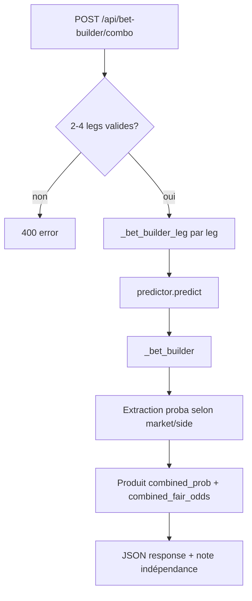
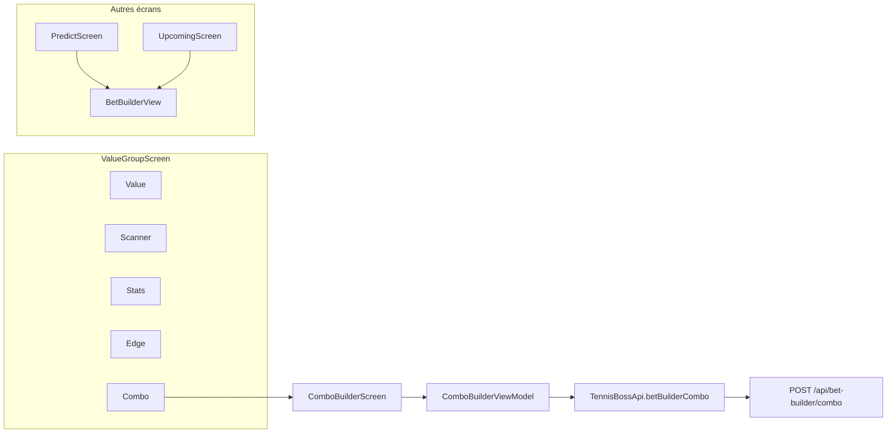

# Audit Combo Builder / Bet Builder — TennisBoss

**Date :** 17 juillet 2026  
**Périmètre :** Bet Builder (marchés dérivés) + Combo Builder (parlay 2–4 legs) sur l’onglet Value  
**Statut code :** commit `44beaa5` (16/07), marqué **Done** dans `MASTER_TODO.md`  
**Contrainte respectée :** `predictor.py`, `calibrate.py` et seuils `/api/value` **non modifiés** — combinatoire uniquement

---

## Résumé exécutif

Le Combo Builder est **fonctionnel de bout en bout** : backend (`POST /api/bet-builder/combo`), modèles Android, onglet **Value > Combo**, et **18 tests backend + 7 tests Android** passent localement (17/07/2026).

**Points forts :**
- Architecture conforme à la frontière figée : `_bet_builder()` et `_bet_builder_leg()` ne font que dériver des probabilités déjà calculées par `predictor.predict()`.
- Couverture solide de la mathématique Bet Builder (`test_predict_math.py`, 12 tests unitaires).
- UX Android claire (2–4 legs, sélection marché, disclaimer indépendance).
- `BetBuilderView.kt` enrichi (total sets, handicap, fair odds, EV match, badge « pari le plus sûr ») — réutilisé sur Prédire et À venir.

**Lacunes principales :**
- **Aucun lien** entre les picks `/api/value` et le Combo Builder (saisie manuelle des noms).
- **EV combo analytique** — champ cote bookmaker + EV%/edge (post-audit 17/07) ; pas de cotes auto odds-api.
- **Sémantique `total_sets` opaque** côté Android (`player1` = Over, `player2` = Under, mais l’UI affiche les noms des joueurs).
- **Pas de garde cross-genre ATP/WTA** sur `/api/bet-builder/combo` (contrairement à `/api/predict`).
- **OpenAPI** : corps de requête documenté, **schéma de réponse absent**.
- **Écart méthodologique vs tipsters pros** : les parlays ne sont pas recommandés par les sharp bettors (CLV, flat stake) ; le combo actuel est un outil éducatif, pas un pipeline value.

**Verdict :** MVP solide pour la combinatoire, **pas encore un produit « value parieur »** aligné avec `/api/value` ni avec `docs/TIPSTER_COMPARISON.md`.

---

## Architecture

### Backend (`bot/api.py`)

| Fonction | Rôle | Conformité predictor freeze |
|----------|------|----------------------------|
| `_bet_builder(p1_set, n1, n2, match_odds?)` | Dérive match, set2, total_sets, handicap, correct_score, best_market | ✅ Combinatoire sur proba 1er set déjà calculée |
| `_bet_builder_leg(p1, p2, surface?)` | `predictor.predict()` → `_bet_builder()` | ✅ Même chemin que `/api/predict` |
| `api_bet_builder_combo()` | Parlay 2–4 legs, produit des probas | ✅ Aucune nouvelle logique de décision |

**Marchés combo supportés :** `match`, `set2`, `total_sets`, `handicap`  
**Mapping `total_sets` :** `side=player1` → Over (+2.5 sets), `side=player2` → Under (−2.5 sets)

**Intégration ailleurs :**
- `/api/predict`, `/api/upcoming` : renvoient `bet_builder` complet (+ `match_odds` → EV réelle sur marché match dans upcoming).
- `/api/value` : pipeline **séparé** — EV blendée, seuils `min_ev`, dead-zone 12–18 %, logging `clv_log`. **Ne consomme pas** le combo builder.

### Android

| Fichier | Rôle |
|---------|------|
| `NavGroups.kt` | Onglet **Combo** (index 4) dans Value |
| `ComboBuilderScreen.kt` | UI saisie 2–4 legs + résultat |
| `ComboBuilderViewModel.kt` | État, validation, appel API |
| `BetBuilderView.kt` | Affichage marchés (Prédire / À venir, **pas** dans Combo) |
| `ApiModels.kt` | `ComboRequest`, `ComboLegRequest`, `ComboResult`, `BetBuilder` |
| `TennisBossApi.kt` | `@POST("api/bet-builder/combo")` |

---

## Contrat API

### Requête — `POST /api/bet-builder/combo`

| Champ | Type | Requis | Description |
|-------|------|--------|-------------|
| `legs` | `array` | ✅ | 2 à 4 éléments |
| `legs[].player1` | `string` | ✅ | Joueur 1 (résolu via `_resolve`) |
| `legs[].player2` | `string` | ✅ | Joueur 2 |
| `legs[].side` | `"player1"` \| `"player2"` | ✅ | Côté parié |
| `legs[].market` | enum | ❌ (défaut `match`) | `match`, `set2`, `total_sets`, `handicap` |
| `legs[].surface` | `string` | ❌ | `hard`, `clay`, `grass` — **supporté backend, absent UI Android** |

### Réponse — 200 OK

| Champ | Type | Description |
|-------|------|-------------|
| `legs` | `array` | Legs enrichies : noms résolus, `prob_pct`, `fair_odds` |
| `legs[].market` | `string` | Marché effectif |
| `n_legs` | `int` | Nombre de legs |
| `combined_probability_pct` | `float` | Produit des probas (%) |
| `combined_fair_odds` | `float` | Produit des cotes justes |
| `book_odds` | `float` | Optionnel — cote combinée bookmaker (si envoyée en requête) |
| `ev_pct` | `float` | Optionnel — EV analytique % si `book_odds` fourni |
| `edge` | `float` | Optionnel — proba modèle − 1/book_odds |
| `note` | `string` | Disclaimer indépendance + cotes théoriques |

### Erreurs

| Code | Condition |
|------|-----------|
| `400` | Moins de 2 ou plus de 4 legs ; `side` invalide ; joueurs manquants |
| `401` | Token API requis si `TENNISBOSS_API_TOKEN` défini |
| `422` | `predictor.predict()` échoue pour une paire |

### OpenAPI (`bot/openapi_spec.py`)

| Élément | Couverture |
|---------|------------|
| Endpoint listé | ✅ |
| Request body | ✅ (legs, side enum, market enum, surface) |
| Response schema | ❌ Réponse générique `_ok()` sans propriétés |
| Codes 400/422 | ✅ Mentionnés |
| Exemple `total_sets` side mapping | ❌ Non documenté |

### Cohérence Android ↔ Backend

| Aspect | Statut |
|--------|--------|
| Modèles Retrofit | ✅ Alignés |
| Marchés enum | ✅ Identiques |
| Champ `surface` | ⚠️ Backend OK, Android ne l’envoie pas |
| Gestion 400/422 | ✅ Messages utilisateur dans ViewModel |

---

## Ce qui fonctionne

### Backend
- [x] `_bet_builder()` : match, set2, total_sets, handicap, correct_score, fair_odds, EV match si `match_odds`, `best_market`
- [x] Combo 2–4 legs avec produit des probas et cotes justes
- [x] Marché inconnu → fallback `match`
- [x] Documentation inline (hypothèse d’indépendance, pas de cotes bookmaker hors match)
- [x] 12 tests `TestBetBuilder` + 1 `TestBetBuilderLeg` + 5 tests endpoint combo

### Android
- [x] Onglet Value > Combo accessible (`value_tab_combo`)
- [x] Saisie 2–4 matchs, choix côté et marché
- [x] Affichage résultat (probas, cotes, note serveur)
- [x] `BetBuilderView` : 4 marchés, badge, EV sur match quand cotes dispo (Upcoming)
- [x] 7 tests `ComboBuilderViewModelTest` (legs, validation, Success/Error)
- [x] Test tags Compose (`combo_calculate`, `combo_leg_*`, etc.)

### Conformité predictor freeze
- [x] Aucune modification de `predictor.py` dans le scope Bet Builder
- [x] `_bet_builder_leg` réutilise le même chemin que `/api/predict`
- [x] Pas d’impact sur seuils `/api/value`, `is_value`, dead-zones, `clv_log`

---

## Ce qui manque ou est incomplet

### Tests

| Test manquant | Priorité | Détail |
|---------------|----------|--------|
| `combined_fair_odds` = produit des fair_odds legs | Moyenne | Non vérifié explicitement |
| Combo 3 et 4 legs | Basse | Seulement 2 legs testés en intégration |
| Marché `set2` dans combo API | Basse | Non couvert dans `test_api_endpoints2.py` |
| Erreur 422 (joueur inconnu) | Moyenne | Non testé |
| Garde cross-genre ATP/WTA | Haute | Comportement non défini / non testé |
| Tests UI Compose `ComboBuilderScreen` | Moyenne | Aucun test d’écran (seulement ViewModel) |
| Test `FakeApi.betBuilderCombo` payload | Basse | Pas de assertion sur le body envoyé |

**Exécution locale (17/07/2026) :** 13 tests `TestBetBuilder*` + 5 tests combo API → **18/18 PASS**.

### UX vs recommandations tipsters (`docs/TIPSTER_COMPARISON.md`)

| Recommandation tipster | État Combo Builder |
|------------------------|-------------------|
| CLV-first, flat stake | ❌ Pas de CLV, pas de tracking combo dans `bet_history` |
| Line shopping / cote réelle | ❌ Cotes justes théoriques uniquement (sauf EV match ailleurs) |
| Éviter parlays (variance ↑, edge dilué) | ⚠️ Outil présent sans avertissement « sharp » explicite |
| Seuil EV minimum (≥6–8 %) | ⚠️ EV combo analytique si cote saisie (pas de filtre value auto) |
| Ajouter picks depuis Value | ❌ Saisie manuelle, pas d’autocomplete joueurs |
| Bankroll / Kelly | ❌ Absent (Planned dans MASTER_TODO) |
| Checklist pré-pari | ❌ Non intégrée au combo |

### Bugs / incohérences

| # | Sévérité | Description |
|---|----------|-------------|
| 1 | **Moyenne** | **UI `total_sets`** : les chips affichent les noms des joueurs alors que `player1`/`player2` signifient Over/Under — risque de pari mal interprété |
| 2 | **Moyenne** | **Pas de garde cross-genre** sur combo ( `/api/predict` renvoie 400 ATP vs WTA ) |
| 3 | **Basse** | **`/api/predict`** ne passe pas `match_odds` à `_bet_builder` → pas d’EV réelle sur l’écran Prédire (Upcoming oui) |
| 4 | **Basse** | **Pas de rate limit** sur combo ( `/api/value` limité 20/min ) — risque abus CPU si token absent |
| 5 | **Info** | Combo et Value utilisent des **logiques EV différentes** — pas un bug, mais source de confusion utilisateur |

### Documentation existante

| Document | Contenu Bet Builder / Combo |
|----------|----------------------------|
| `MASTER_TODO.md` § Bet Builder | ✅ Statut Done, liste items |
| `docs/DEVELOPMENT_AUDIT_2026-07-16.md` | ✅ Audit global incluant combo |
| `docs/ARCHITECTURE_BLUEPRINT.md` | ✅ Endpoint listé, extension points |
| `docs/TIPSTER_COMPARISON.md` | ❌ Aucune mention combo/parlay |
| `PROJECT_STATUS.md` | ✅ Mention ComboBuilder ~85 % |
| `docs/COMBO_BUILDER_AUDIT.md` | ✅ Ce document |

---

## Risques

### Conformité predictor freeze — **Risque faible ✅**

Le code respecte la règle : Bet Builder = combinatoire post-`predict()`. Aucune modification des gates value. **Recommandation :** ajouter un test de non-régression CI qui vérifie que `predictor.py` et les constantes `/api/value` (`min_ev`, dead-zone) restent inchangés sur les PR touchant `_bet_builder`.

### Risque produit / parieur — **Risque moyen ⚠️**

- L’utilisateur peut construire un combo à **cote théorique attractive** sans edge réel vs bookmaker.
- L’**hypothèse d’indépendance** est documentée mais facilement ignorée (même tournoi, conditions corrélées).
- Les tipsters pros **évitent les parlays** pour le ROI long terme ; exposer le combo dans Value sans garde-fous peut encourager une mauvaise pratique.

### Risque technique — **Risque faible**

- Charge CPU : chaque leg = `predictor.predict()` complet ; 4 legs × usage intensif acceptable pour un outil manuel.
- Pas de cache par paire joueurs dans combo (recalcul à chaque requête).

---

## Recommandations priorisées (ROI)

| Prio | Action | Impact ROI / UX | Effort | Predictor freeze |
|------|--------|-----------------|--------|------------------|
| 🔴 1 | **Lier Value → Combo** : bouton « Ajouter au combo » sur `ValueCard` | Fort — réduit friction, combos basés sur picks déjà filtrés EV | Moyen | ✅ |
| 🔴 2 | **Corriger UI `total_sets`** : chips « Plus / Moins » au lieu des noms joueurs | Fort — évite paris mal formulés | Faible | ✅ |
| 🔴 3 | **Avertissement parlay** (banner + lien TIPSTER_COMPARISON) : variance, pas de CLV combo | Moyen — alignement éducatif pro | Faible | ✅ |
| 🟡 4 | **Autocomplete joueurs** (`/api/players`) dans ComboBuilderScreen | Moyen — moins d’erreurs 422 | Moyen | ✅ |
| 🟡 5 | **Garde cross-genre** + tests 422/400 | Moyen — cohérence API | Faible | ✅ |
| 🟡 6 | **OpenAPI response schema** + doc `total_sets` side | Faible dev, fort intégration | Faible | ✅ |
| 🟡 7 | **EV combo optionnelle** : si toutes legs `market=match` + cotes odds-api | Fort analytique, complexe | Élevé | ✅ (combinatoire sur cotes existantes) |
| 🟢 8 | Champ **surface** dans UI combo | Faible | Faible | ✅ |
| 🟢 9 | Tests `combined_fair_odds`, 3–4 legs, set2, 422 | Qualité | Faible | ✅ |
| 🟢 10 | **Tracking combo** dans `bet_history` (optionnel, manuel) | Mesure ROI parlays | Moyen | ✅ |

---

## Prochaines tâches dev suggérées (Combo sur Value)

### Sprint 1 — UX critique (1–2 j)
1. Fix chips `total_sets` → « Plus de 2.5 sets » / « Moins de 2.5 sets »
2. Banner disclaimer parlay (variance, indépendance, pas de CLV)
3. Autocomplete joueurs via `PlayersViewModel` / debounce search

### Sprint 2 — Intégration Value (2–3 j)
4. `ValueCard` : action « + Combo » → pré-remplit une leg (joueurs, side favori value, market match)
5. Navigation deep-link ou `SharedViewModel` Value ↔ Combo
6. Garde cross-genre backend + test

### Sprint 3 — Qualité & docs (1 j)
7. Compléter OpenAPI (response schema, exemples)
8. Tests manquants (fair_odds produit, 422, set2 combo)
9. Mettre à jour `docs/TIPSTER_COMPARISON.md` § parlays / combo

### Sprint 4 — Analytique (optionnel, post n≥200)
10. EV combo avec cotes bookmaker réelles (legs match uniquement)
11. Export combo vers `bet_history` pour mesurer ROI parlays vs singles

---

## Annexe — Fichiers audités

| Chemin | Rôle |
|--------|------|
| `bot/api.py` | `_bet_builder`, `_bet_builder_leg`, `api_bet_builder_combo` |
| `bot/openapi_spec.py` | Spec OpenAPI |
| `bot/predictor.py` | Cœur figé (lecture seule audit) |
| `tests/test_predict_math.py` | Tests Bet Builder |
| `tests/test_api_endpoints2.py` | Tests endpoint combo |
| `android/.../ComboBuilderScreen.kt` | UI Combo |
| `android/.../ComboBuilderViewModel.kt` | ViewModel |
| `android/.../components/BetBuilderView.kt` | UI marchés |
| `android/.../NavGroups.kt` | Onglet Value > Combo |
| `android/.../data/ApiModels.kt` | Contrats |
| `android/.../ComboBuilderViewModelTest.kt` | Tests Android |
| `MASTER_TODO.md` | Statut projet |
| `docs/TIPSTER_COMPARISON.md` | Benchmark parieurs |

---

*Audit réalisé par lecture de code et exécution de tests — aucune modification de la logique de production.*

---

## Implémentation post-audit (2026-07-17)

| Recommandation | Statut | Fichiers |
|----------------|--------|----------|
| 🔴 Value → Combo (« Ajouter au combo ») | **Done** | `ValueCard.kt`, `ValueScreen.kt`, `NavGroups.kt`, `ComboBuilderViewModel.kt` |
| 🔴 UI `total_sets` Plus/Moins | **Done** | `ComboBuilderScreen.kt`, `BetBuilderView.kt` |
| 🔴 Banner parlay éducatif | **Done** | `ComboBuilderScreen.kt`, `ComboBuilderViewModel.kt` |
| 🟡 EV combo vs cote bookmaker (analytique) | **Done** | `bot/api.py`, `ComboBuilderViewModel.kt`, `ComboBuilderScreen.kt` |
| Tests Android (+4 ViewModel) | **Done** | `ComboBuilderViewModelTest.kt` |

**Value → Combo :** bouton sur les picks EV+ → `addLegFromValuePick()` pré-remplit joueurs + côté `best_side` (marché match) → navigation onglet Combo (ViewModel partagé dans `ValueGroupScreen`).

**EV combo analytique :** champ « Cote combo bookmaker » dans le résultat ; EV% = `(proba × cote − 1) × 100`, edge = `proba − 1/cote`. Backend accepte `book_odds` optionnel dans `POST /api/bet-builder/combo` et renvoie `ev_pct` / `edge` ; Android recalcule en local à la saisie (même formule que `_bet_builder` match EV).
